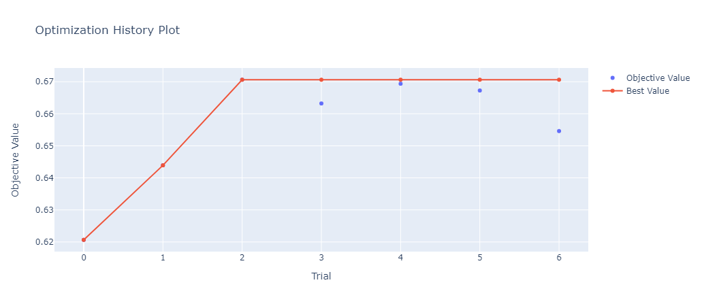

# Webmedia22

Competition link:

https://www.kaggle.com/competitions/webmedia22/leaderboard

It was a problem with imbalanced dataset, I tried some approaches like smote to deal with this, however the best solution was apply weights and some regularization.

    

    

I decided to use lightgbm to build the model. During the process I created a nested cross-validation with optuna to test different hypterparamenters. The image bellow show 35 trials that was one trial by fold, in this case, K-fold = 5, so in total was 7 trial (35/5).

    

    

    

    

I also tried to track the importance of the features during each k fold, It was not the best solution, but it was useful to check new features, for example "temp_3_sin".

<table border="1" class="dataframe">
  <thead>
    <tr style="text-align: right;">
      <th></th>
      <th>importance_gain</th>
      <th>importance_split</th>
    </tr>
    <tr>
      <th>feature_name</th>
      <th></th>
      <th></th>
    </tr>
  </thead>
  <tbody>
    <tr>
      <th>cd_15_prep_2</th>
      <td>135593.957161</td>
      <td>2554.342857</td>
    </tr>
    <tr>
      <th>regiao_4</th>
      <td>129208.585965</td>
      <td>2502.942857</td>
    </tr>
    <tr>
      <th>cd_15_prep_3</th>
      <td>118705.265967</td>
      <td>1369.057143</td>
    </tr>
    <tr>
      <th>cd_16_prep_2</th>
      <td>113099.286670</td>
      <td>2412.914286</td>
    </tr>
    <tr>
      <th>temp_3_sin</th>
      <td>102689.233927</td>
      <td>1732.000000</td>
    </tr>
    <tr>
      <th>cd_16_prep_6</th>
      <td>101694.174364</td>
      <td>1885.457143</td>
    </tr>
    <tr>
      <th>cd_15_prep_6</th>
      <td>99460.228286</td>
      <td>1864.800000</td>
    </tr>
    <tr>
      <th>dem_6</th>
      <td>87018.837911</td>
      <td>2019.600000</td>
    </tr>
    <tr>
      <th>regiao_6</th>
      <td>53554.429346</td>
      <td>1999.257143</td>
    </tr>
    <tr>
      <th>regiao_19</th>
      <td>53110.557960</td>
      <td>1483.200000</td>
    </tr>
  </tbody>
</table>

This model achieved 0.66 on auc roc, it is the combination of 5 kfold, the pipeline has some custom transform to create new feature and I did not use any preprocessing step because I acquired better results this way.

    

    

The weights was one of the hyperparameter used to deal with the imbalanced dataset. It is possible to see that the models gained a good performance with 4 to 8 for the class 1.

    

    

I used mlflow to track the models during the training that was useful.

    

    

In the end, I did some ensembles with the lightgbm and logistic regression models trained with rapids.

    

    

I achieved 5 position with 32 teams and 41 people, that was a small competition but I learned a lot.

    

    

My conclusion
- I should use a stacking cross-validation, I wasted some models that could be usuful to improve the ensemble methods.
- Rapids was really fast, but I only started to use it on the last day with few hours to finish the competition.
- Dimension reduction could help to train more fast, I did some test with UMAP.
